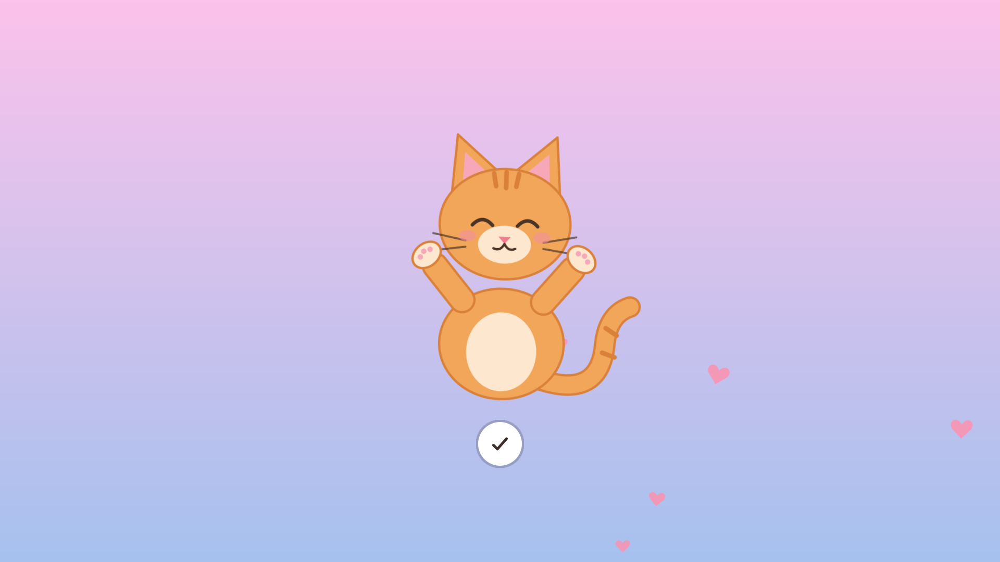

# Tibet

A GNOME Shell extension that gets you out of your chair. Every so often it covers the screen with an animated buddy who stretches with you. Tap ✓ to get back to work.

Characters: **Dalai Llama**, **Gatito**, **Cozy Girl** or **Random** (a different one each time).



## Install

From [GNOME Extensions](https://extensions.gnome.org/extension/11148/tibet/), or from source:

```sh
make install
```

On Wayland, log out and back in. Then:

```sh
gnome-extensions enable tibet@JaimeAlonsoGA.github.io
gnome-extensions prefs tibet@JaimeAlonsoGA.github.io
```

Works with GNOME Shell 48 and 49.

## Contributing

Tibet is free software under the [GPL-2.0-or-later](LICENSE). Want to add a character, fix something or suggest an idea? Open an issue or a pull request. See [CONTRIBUTING.md](CONTRIBUTING.md).
